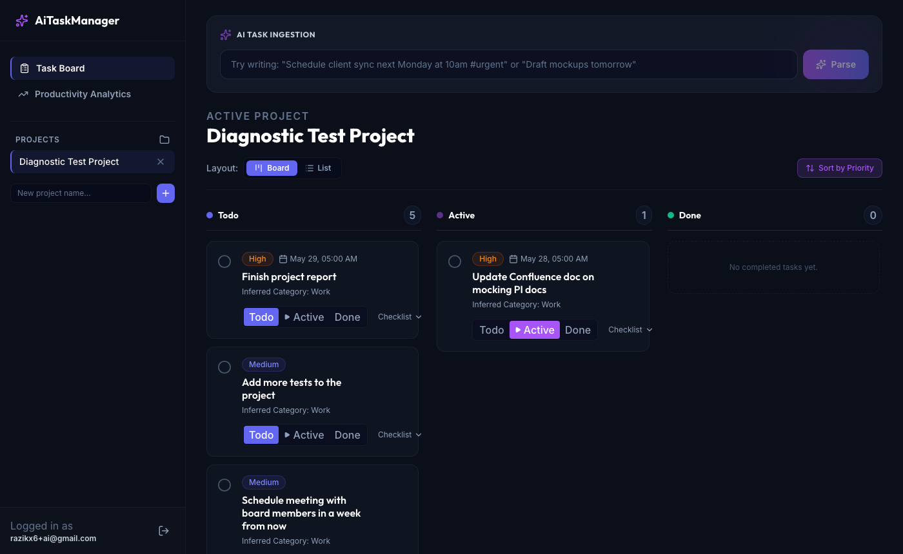

# AiTaskManager

AI-powered task manager with natural language input. Write tasks in plain English — the app parses priority, due date, and category automatically using Claude Haiku.

**Live demo:** https://frontend-kappa-sand-ihllnsfmku.vercel.app



---

## Features

- **NLP task parsing** — type "Finish report by Friday, high priority" and Claude extracts the structured fields
- **AI subtask generation** — expand any task into actionable subtasks automatically
- **Kanban board** — Todo / Active / Done columns with drag-free status transitions
- **Smart prioritization** — sort by AI-inferred priority across projects
- **Real-time sync** — Supabase live subscriptions keep all tabs in sync
- **Auth** — email/password via Supabase Auth with JWT-protected API

---

## Stack

| Layer | Tech |
|---|---|
| Frontend | React 19, TypeScript 5, Tailwind CSS, Vite |
| Backend | Node.js, Express, JWT auth middleware |
| Database / Auth | Supabase (PostgreSQL, RLS, real-time) |
| AI | Claude Haiku 4.5 (`claude-haiku-4-5-20251001`) |
| Hosting | Vercel (frontend) · Railway (backend) |

---

## Architecture

```
Browser (React)
  │  Supabase SDK — auth, real-time
  │  Axios — API calls
  ▼
Express Backend (Railway)
  │  authGuard — verifies Supabase JWT
  │  /api/ai/parse-task — Claude NLP
  │  /api/tasks, /api/projects, /api/subtasks
  ▼
Supabase (PostgreSQL + RLS)
```

**Key constraint:** the Anthropic SDK is never imported client-side. All Claude calls go through the Express proxy.

---

## Local Development

### Prerequisites
- Node.js 20+
- A [Supabase](https://supabase.com) project
- An [Anthropic](https://console.anthropic.com) API key

### 1. Clone
```bash
git clone https://github.com/razikx/AiTaskManager.git
cd AiTaskManager
```

### 2. Backend
```bash
cd backend
npm install
cp .env.example .env   # fill in your values
npm run dev
```

### 3. Frontend
```bash
cd frontend
npm install
cp .env.example .env   # fill in your values
npm run dev
```

Frontend runs on `http://localhost:5173`, backend on `http://localhost:4000`.

---

## Environment Variables

**`backend/.env`**
```
PORT=4000
NODE_ENV=development
CORS_ORIGIN=http://localhost:5173
SUPABASE_URL=
SUPABASE_ANON_KEY=
SUPABASE_SERVICE_ROLE_KEY=
SUPABASE_JWKS_URL=
ANTHROPIC_API_KEY=
```

**`frontend/.env`**
```
VITE_SUPABASE_URL=
VITE_SUPABASE_ANON_KEY=
VITE_API_URL=http://localhost:4000/api
```

---

## Database

Migrations are in `/supabase/migrations/`. Run them in order against your Supabase project via the Supabase dashboard SQL editor or CLI.

---

## Deployment

| Service | Config |
|---|---|
| Vercel | Root: `/frontend` · Build: `npm run build` · Output: `dist` |
| Railway | Root: `/backend` · Start: `npm run build && npm start` |

Set the production env vars in each platform's dashboard. `VITE_API_URL` must point to your Railway URL with the `/api` suffix.
